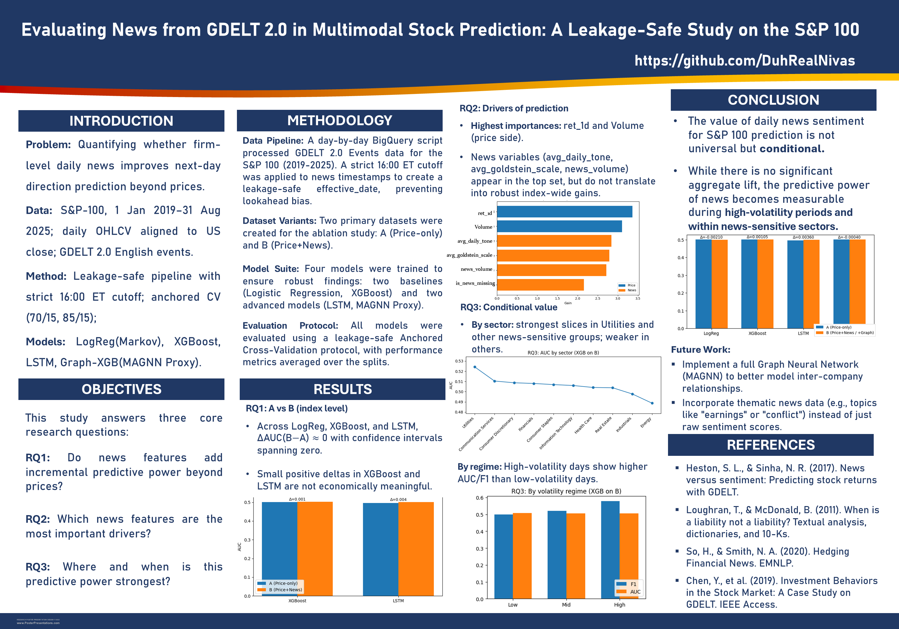

# gdelt-2.0-stock  
Evaluating whether GDELT 2.0 daily news features improve next-day S&P 100 direction prediction beyond prices, using a leakage-safe 16:00 ET cutoff and anchored cross-validation (2019–2025).

## Project title
**Evaluating News from GDELT 2.0 in Multimodal Stock Prediction: A Leakage-Safe Study on the S&P 100**

## Overview
This repository contains the code and artefacts for an MSc Data Science dissertation project evaluating whether firm-level daily news signals from **GDELT 2.0** improve **next-day S&P 100 direction prediction** beyond price/volume information. A **leakage-safe** data pipeline is used with a strict **16:00 ET cutoff** (aligned to the US market close) to ensure that only information available by the close is used for next-day prediction. Model performance is assessed using an **anchored cross-validation** protocol across **2019–2025**.

## Poster

  

## Licence
MIT Licence.
